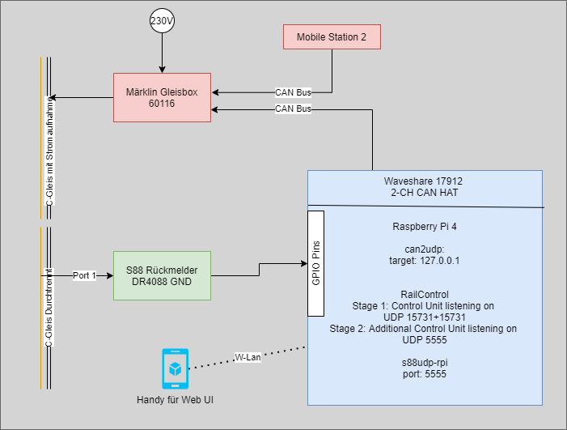

## Why another page about model railroads?

When it comes to model railroads, you soon stumble over lots of new terms you have most likely never heard before. And when you start googeling for them you either get answers with more terms you don't understand or a product that is quite expense.

## What you find here (hopefully)

I was starting out with a starter kit from Märklin and soon noticed - i want to control stuff not only by hand or the `Mobile Station 2`. I would like to control stuff with my phone / pc / raspberry ... So i wanted to build a setup that fits my comfort zone.

**In the zone**
- Raspberry Pi
- Arduino
- Linux (a bit)
- Development / Setup of software

**Not in my zone**
- PCB development
- Soldering smd stuff
- low level chip programming
- spending lots of money

Thats where i started googeling and soon found my first approach to control a digital Märklin H0 scale train with my raspberry. Stage two is still in progress but goes in to direction of automating thinks. Could be a shuttle train or station with a "random" train picker - we will see. The tech needed is the same anyway. For stage three i think of adding more signals, automated switches and other funny stuff.

## Conclusion

Creating a central station based on openSource software and common hardware parts **without soldering** is a bit fiddly but a nice way to build a setup that allows a lot of the common scenarios without braking the bank.

### What i spend:

Stage 0 (Get your first digital kit from Märklin (always look around for special offers)) :

- Only the needed "Gleisbox/Trackbox" 60116 + power + some tracks ~ > 70€
- Without Train ~ 200 €
- With cargo train ~ 300 €
- With ICE 2 ~ 400 € (got it for 330 at a x-mas deal)

Stage 1:
- Raspberry Pi 4 (just had one, a version 2 or 3 might also work) ~ 50-60 €
- CAN-Head [velectron](https://www.welectron.com/navi.php?qs=Waveshare+17912) 25 €
- MS2 Replacement cable (if to lazy to make your own) ~ 13 €

Stage 2:

- S88 Sensor module [DR4088](https://www.digikeijs.com/de/modelleisenbahn-ruckmeldemodul-dr4088gnd.html) from ebay for 30€ new
- (optional) Hair tint (in case you get grey hair during troubleshooting) 10 €

So overall i spend 330 € on initial Train set, 80€ on PC-like control and 30€ on the automation. So a total of 440€ does not sound to bad to me.
(In case you calculate in $, right now 1$ = 1€)

> Central Station 3 ~ 700€ vs DIY ~ 80€ + a headache

## The theory

## Stage 0

Setup your basic track and have some fun!!!

## Stage 1

> Running trains via computer like device

### Hardware

todo wireing

### Software

todo base setup can

### Configuration

todo setup railcontrol for manual mode

### Result

todo video with smartphone control

---

## Stage 2

> First automation

### Hardware

todo wireing, make contaktgleis

### Software

todo base setup can

### Configuration

todo setup railcontrol for manual mode

### Result

### Result

---

## Stage 3

> tbd

### Hardware

### Software

### Configuration

### Result

---

## Sources

The Raspberry PI CAN Central Station (german-forum) [open](https://www.stummiforum.de/t148950f7-Raspberry-Pi-CAN-Interface-zur-Gleisbox-Anbindung.html#msg2223890) \
The first intro from my post in the forum (germen forum) [open](https://www.stummiforum.de/t200531f5-Anfaenger-DIY-Central-Station.html) \
The post about the s88 troubleshooting (german forum) [open](https://www.stummiforum.de/t207818f5-Anfaenger-DIY-Central-Station-Rueckmelder.html) \
s88udp project [open](https://github.com/GBert/railroad/tree/master/can2udp)
